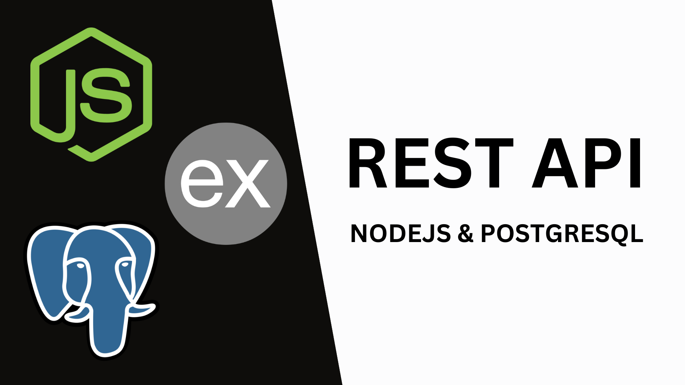

# NODEJS-POSTGRESQL-RESTAPI



## INTRODUCTION

In this project we will create a REST API using **Express.js** as a **Node.js** framework and "pg" as a connection module to our **PostgreSQL** database.

## TECHNOLOGIES

- Node.js
- Express.js
- PostgreSQL

## INSTALLATION

1. Install the recommended version for most users of **Node.js** from the following link.

https://nodejs.org/en

2. Install the latest stable version of **PostgreSQL** from the following link.

https://www.postgresql.org/

3. Use the **npm** package manager to install.
4. Execute the command from the terminal located in ./NODEJS-POSTGRESQL-RESTAPI.

```shell
npm i
```

5. Create a database using the commands found inside the database folder in the database.sql file.
6. Create an .env file inside ./NODEJS-POSTGRESQL-RESTAPI and replace `userpostgres` and `passwordpostgres` with your credentials.

```js
DB_HOST = localhost
DB_USER = userpostgres
DB_PASSWORD = passwordpostgres
DB_NAME = firstapi
```

## EXECUTION

7. Use the **npm** package manager to run.
8. Execute the command from the terminal located at ./NODEJS-POSTGRESQL-RESTAPI.

```shell
npm run dev
```
